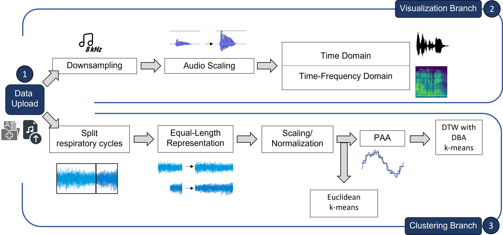
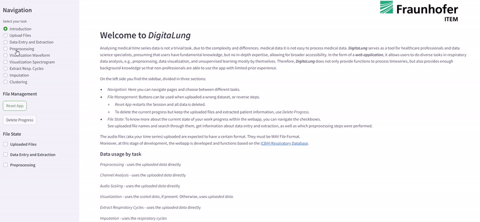

# DigitaLung 
**by**  &emsp;&emsp;&emsp;    

This web application was developed by **Fraunhofer Institute for Toxicology and Experimental Medicine**,
the Project Group for **Bioinformatics and Digital Health**.  
Official Website: [Fraunhofer ITEM / Services Expertise / Bioinformatics](https://www.item.fraunhofer.de/en/services-expertise/bioinformatics.html)

Web Application **DigitaLung** (V.1.0) for **Time Series Analysis** of **Respiratory Data**.

-----------------------------------------------------------------------------------------------------------------------
## Key Topics
Explore the following key topics in this documentation: 
- [Overview](#overview)
- [Database](#database)
- [Streamlit](#streamlit)
- [Running the Application Locally](#running-the-application-locally)
- [Containerized Deployment with Docker](#containerized-deployment-with-docker)
- [Web App Workflow](#web-app-workflow)
- [Web App UI](#web-app-ui)
- [Repository Structure](#repository-structure)
- [Helpful Links](#helpful-links)

-----------------------------------------------------------------------------------------------------------------------
## Overview
Analyzing medical time series is not a trivial task due to the complexity and differences in medical data. 

**_DigitaLung_** serves as a tool for healthcare professionals and data science specialists, presuming that users have 
fundamental knowledge, but no in-depth expertise, allowing for broader accessibility.
In the form of a **_web application_**, it allows users to do diverse tasks in respiratory data analysis,
e.g., preprocessing, data visualization, and unsupervised learning mostly by themselves.

-----------------------------------------------------------------------------------------------------------------------
## Database
The web application was developed using the publicly available [**International Conference on Biomedical and Health 
Informatics (ICBHI) 2017 Respiratory Sound Database**](https://www.kaggle.com/datasets/vbookshelf/respiratory-sound-database).
 
It is an excellent resource for the biomedical community.
With its large variety of annotated respiratory cycles and adventitious sounds, as well as accompanying metadata, 
it holds potential for uncovering respiratory pattern insights through time series analysis.
  
Please upload only files from the database; if other personal files are uploaded, only preprocessing and visualization tasks are
available.

-----------------------------------------------------------------------------------------------------------------------
## Streamlit
This project was developed using [**Streamlit**](https://github.com/streamlit/streamlit), version 1.28.2. 
Streamlit is a dashboarding tool designed for rapid prototyping with minimal code footprint. It comes with a bunch of 
widgets for front-end development and other easy to use ones. 
Streamlit handles the interaction between different parts of the app and is responsible to hold important information 
in session states. To achieve efficiency, decorators are utilized to skip resource-intensive computations 
during application iterations.

-----------------------------------------------------------------------------------------------------------------------
## Running the Application Locally

First, install your python IDE (e.g. [PyCharm](https://www.jetbrains.com/pycharm/download/?section=windows)). 
In order to link PyCharm with the Git repository follow the [instructions](https://www.jetbrains.com/help/pycharm/set-up-a-git-repository.html#clone-repo).

### Environment Setup
#### Using Anaconda
- Install [Anaconda](https://www.anaconda.com/products/individual) (optional: 
[Miniconda](https://docs.conda.io/projects/miniconda/en/latest/miniconda-install.html)).
- Get the `environment.yml` file from the project, found under _**DigitaLung -> environment.yml**_.
- Put the `environment.yml` file under `C:\Users\<your_username>`.
- Open an Anaconda prompt. No conda environment should be active. This means you should be on `(base)`.
- Create a new environment with the settings and packages of the environment.yml using the command: 
`conda env create -f environment.yml`.

All necessary packages to run DigitaLung should be installed automatically.  You can check under 
`C:\Users\<your_username>\Anaconda3\envs\` if the environment with the name mentioned inside the 
`environment.yml` file exists.
#### Using requirements.txt File
- Create a new virtual environment under the name `digitalung_venv`. Choose `Python 3.10.`. 
- Once activated, run in the terminal `pip install -r requirements.txt`

All necessary packages to run DigitaLung should be installed automatically.  You can check with `pip freeze`
if the installation was successful. 

Once the environment is set up, associate it with your project in your chosen IDE. 

### Starting and Accessing the Streamlit Application
To run the Streamlit application locally, you have two main options:
- ##### Using the Run Button
A `run.py` file is used to enable running Streamlit via PyCharm's '_run_' button. 
Ensure `run.py` is set as the script to run in your project configuration.
- ##### Using Command Line
Use the command `streamlit run digitalung\<entrypoint.py>`, replacing `<entrypoint.py>` with the module that starts 
the app.
  
For this project, the specific command is `streamlit run digitalung\digitalung.py`.

Once the Streamlit application is running, the application window typically opens automatically.
You can also access it 
locally by navigating to `http://localhost:8501/`.
 
The app will automatically reload if you change any of the source files.
Choose "Always rerun" in 
`http://localhost:8501/`.

-----------------------------------------------------------------------------------------------------------------------
## Containerized Deployment with Docker
The web app offers tools regarding unsupervised machine learning, which inherently have a resource-intensive nature. 
Substantial computational power is recommended to ensure optimal performance in terms of memory allocation and 
processing speed.

We deployed the application on a high-capacity server. To do the same:
- Utilize the `Dockerfile`, prepped for this specific web app. The exposed port is 8501.
- Build the Docker image
- Pull and run the image in a server. Use `docker run -p desired_server_port:8501 ...`. 
- Access through `http://server_name:desired_server_port/`

-----------------------------------------------------------------------------------------------------------------------
## Web App Workflow
The audio files of respiratory sounds, as well as accompanying patient-related metadata, can be 
uploaded, as the first step.  
Once completed, the web application implements two separate workflows for data analysis: 
1. **Visualization** of audio files in time and time-frequency domain 
2. **Clustering** of respiratory cycles with Euclidean and DTW with DBA k-means

Each task (upload, scaling, PAA ...) is chosen and tailored to the nature of the data as a medical sound,
audio signal and time series.

-----------------------------------------------------------------------------------------------------------------------
## Web App UI
It is a multipage Streamlit App, with a sidebar navigated to the left. 
- **Navigation** section for page selection
- **File Management** buttons for session state control
- **File State** checkboxes for information about current state

The webapp has the following pages:

| Web App Page                                         | Contents                                                                                                                                                      |
|------------------------------------------------------|---------------------------------------------------------------------------------------------------------------------------------------------------------------|
| Introduction                                         | Explanatory text                                                                                                                                              |
| Upload Files                                         | Two widgets for **audio upload**: uploader and multiselect. Audio must be from [ICBHI Database](#database).                                                |
| Data Entry and Extraction                            | Extract **metadata upload** from the [ICBHI Database](#database) related to the uploaded files.                                                               |
| Preprocessing                                        | Perform **audio scaling** before visualization.  Note: Channel analysis is just informative for the user. It is not part of the data processing pipeline. |
| Visualization Waveform Visualization Spectrogram | **Plot files in two domains** with different options, always accompanied by an audio widget.                                                                  |
| Extract Respiratory Cycles                           | Split audio clips in **respiratory cycles** based on the [ICBHI Database](#database) expert annotations. **Resize** to a desired length.                  |
| Imputation                                           | Optional                                                                                                                                                      |
| Clustering                                           | Prep files for clustering: apply **Scalers** and **PAA**.  Apply **k-means clustering** with Euclidean or DTW with DBA.                                   |

The workflow of the different pages is always the same:
1. Explanatory text about the general functionality of the current page
2. Checks that make sure if all necessary previous tasks are done
    * if not done, give feedback about necessary steps
3. One or more streamlit columns with each column containing a separate streamlit form
    * Forms are understandable separate entities
    * Forms are used because of performance issues with reloading widgets after every change
4. Submit button check outside the scope of the column
   * Otherwise, only column width is used to display all the following write commands 
   * Submit button calls needed functions of the corresponding module
5. Feedback about the process. Either via write commands inside the function, or after finishing function call

-----------------------------------------------------------------------------------------------------------------------
## Repository Structure
Our repository for DigitaLung contains different folders with different purposes. 

### digitalung Folder
The `digitalung` folder contains the web application.
It is divided into subfolders dedicated to specific tasks.
Each subfolder corresponds to a page within the web app, making navigation straightforward.

| Subfolder                  | Web App Page                                         |
|----------------------------|------------------------------------------------------|
| intro_page                 | Introduction                                         |
| file_upload                | Upload Files                                         |
| data_entry_and_extraction  | Data Entry and Extraction                            |
| preprocess                 | Preprocessing                                        |
| visualization              | Visualization Waveform Visualization Spectrogram |
| extract_respiratory_cycles | Extract Respiratory Cycles                           |
| imputation                 | Imputation                                           |
| clustering                 | Clustering                                           |

#### digitalung.py File
Entrypoint of the main app is the module `digitalung.py`.
This python file calls every other module. 
Changes like streamlit session states should be done here if possible.
This rule should only be deviated from in 
exceptional cases.

The `main()` function within the module contains general settings like session states and also a dictionary 
containing the different navigation points in the sidebar that represent the different functionalities implemented.  
Widgets and everything else that should be visible at all time and has to be located here.
From the main function, the `_select_page()` function is called, which shows different widgets and explanatory text 
depending on the selected page in the navigation menu. 

#### general_utilities 
The `general_utilities` folder is the place for the supporting module `utilities.py`, that doesn't implement a 
'real functionality' for time series analysis, but rather has functions that are used in different modules and provide 
general functionality.

### Dockerfile
Our development workflow includes a continuous integration and continuous deployment (CI/CD) pipeline that automates 
the creation of a Docker image for DigitaLung. This process utilizes a Dockerfile, which contains commands to 
configure the Docker image for the application. The Docker image is optimized for deployment and includes all 
necessary dependencies and configurations to run DigitaLung.

### requirements.txt
Contains all the packages that should be installed for the Docker image.
It can be used to set up a virtual environment
locally, as detailed in [Using requirements.txt File](#using-requirementstxt-file).

### environment.yml
Contains all the dependencies needed for environment set up, as detailed in [Using Anaconda](#using-anaconda). 

-----------------------------------------------------------------------------------------------------------------------
## Helpful Links
* [Managing Conda Environments](https://conda.io/projects/conda/en/latest/user-guide/tasks/manage-environments.html)
* [Streamlit](https://streamlit.io/)
* [Docker Documentation](https://docs.docker.com/)
* [Python PEP 8](https://www.python.org/dev/peps/pep-0008/)
* [Python PEP 257](https://www.python.org/dev/peps/pep-0257/)
* [On Python PEP 8](https://realpython.com/python-pep8/)
